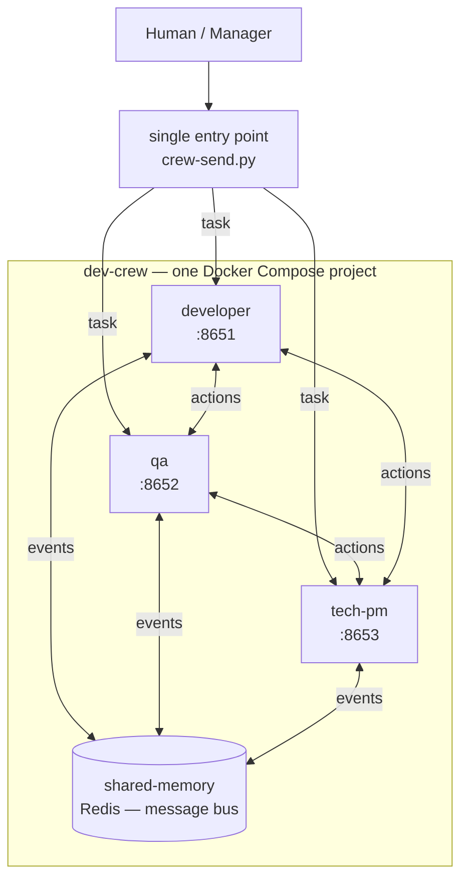

# Dev Crew — portable agent factory

A software development team made of isolated agents (Docker containers) that you can spin up anywhere with a single command. Every engineer runs in its own container, with its own tools and skills.

## The team

**Agents** — one container each, with its own tools and skills:

| Container | Role | Door (webhook) |
|-----------|------|----------------|
| `developer` | Writes code, opens PRs | `:8651` |
| `qa` | Tests and verifies quality | `:8652` |
| `tech-pm` | Breaks down work, prioritizes | `:8653` |
| `devops` | Owns test/staging env, deploys merged code | `:8654` |

**Infrastructure** — shared services, one container each:

| Container | Purpose | Host ports |
|-----------|---------|------------|
| `shared-memory` | Redis message bus | `:6379` |

Project services (databases, apps) live in each project's own compose file, not in
the foundation (see "Generic environments" below).

## How they communicate



- **One entry point** — a human or manager sends a task through `crew-send.py`, which signs it (HMAC-SHA256) and POSTs it to any agent's webhook door.
- **Agent ↔ agent** — any agent can address another through the same door (container DNS inside the `crew` network).
- **Shared bus** — `shared-memory` (Redis) is the common action registry for broadcast events between agents.

## Workflow (end to end)

Agents follow a spec-first pipeline. Every task passes through these stages:

1. **Spec** — manager + tech-pm write the OpenSpec spec.
2. **Adversarial review** — every involved agent reviews the spec from its own
   lens (product / engineering / infra / testability) and posts a comment on the
   spec's GitHub issue: a verdict (`approve` / `needs-changes`) + at most 3
   blocking findings. Evaluation, not redesign.
3. **Plan & decompose** — tech-pm turns the reviewed spec into a plan; if the work
   is too large, it is split into smaller tickets (Linear). The manager decides.
4. **Implement** — developer implements a piece on a `feature/<ticket>-slug`
   branch, opens a PR, and waits for review (does not self-merge).
5. **Code review** — qa + manager review the PR against the spec.
6. **Merge** — only after review passes.
7. **Deploy to dev** — devops deploys the merged code to `dev-env` (first test cluster).
8. **QA testing** — qa updates the test plans, runs tests, records a test report.
   Bugs are published to the shared-memory bus (`bug.found` + debugging info).
9. **QA approve** — qa approves the build and signals devops.
10. **Deploy to staging** — devops deploys the approved build to `staging-env`.

### Escape hatch (critical override)

In a critical situation the manager MAY override the workflow (skip review, deploy
directly, etc.) by explicitly approving the override. Every override is recorded
immediately as **tech debt** — a GitHub issue labelled `tech-debt` — so the
shortcut is never silent.

Linear ticket comments are the discussion channel (persistent + human-visible);
Redis stays the signal/notification layer.

## Generic environments (project-agnostic)

The factory ships with two empty networks any project can use — no per-project setup:

| Environment | Network (name) |
|-------------|----------------|
| `dev-env` | `dev-crew-dev-env` |
| `staging-env` | `dev-crew-staging-env` |

Each project brings its own services via `workspace/<project>/compose.yml` and
attaches to `dev-env` / `staging-env` via `external: true`. Connection strings and
credentials live in the project, not the foundation.

## Project layout

```
docker-compose.yml          # the whole team: 4 agents + Redis + clusters
agents/<name>/hermes-home/  # isolated home per agent (config.yaml + SOUL.md)
crew/crew-send.py           # door client — send a message to any agent
crew/agents.json            # agent registry (urls + secrets, gitignored)
bus/action-schema.json      # message schema for the bus
dashboard/app.py            # observability dashboard + run-supervision view
dashboard/factorybus.py     # shared Redis/Linear clients (stdlib only)
dashboard/completion_watcher.py  # deterministic task hooks (start/finish/stale)
tokens/tokens.example.yaml  # per-agent tokens template
workspace/                  # shared code area (mounted into agents; gitignored)
```

## Quick start

```bash
# 1. Start the factory (3 agents + Redis bus + dev/staging clusters)
docker compose up -d

# 2. Ping an agent via CLI
docker exec dev-crew-developer hermes chat -q "hello"

# 3. Send a message through a webhook door (from the host)
python3 crew/crew-send.py developer "do this task"

# 4. Agent → agent (from inside a container)
docker exec dev-crew-developer python3 /opt/crew/crew-send.py qa "request" --container
```

Doors map to host ports: `developer` 8651, `qa` 8652, `tech-pm` 8653, `devops` 8654.
Agent registry: `crew/agents.json` (real, gitignored) + `crew/agents.example.json` (template).

## Dashboard (observability)

```bash
python3 dashboard/app.py              # team status → http://localhost:8660
python3 dashboard/completion_watcher.py  # deterministic task hooks (separate process)
```

Live team view: which agents are up, their state (`working` / `idle` / `down`) and the
current task. A reporter loop polls each agent's `/health` + gateway log and writes
status/activity to Redis (`shared-memory`). The dashboard renders it as a live page
(auto-refresh every 2s) plus a **run-supervision** view (a run = a Linear Project:
tickets + states + assignees + agent activity + token/call cost).

The **completion watcher** is the deterministic task-hooks runtime
(`task-completion` spec): it tails each gateway log and, on inbound/response,
publishes `task.started` / `task.finished` / `task.stale` to the bus, best-effort
auto-comments Linear and moves ticket state, and pings the manager webhook
(`MANAGER_WEBHOOK_URL`). Configure via `.env` (`LINEAR_API_KEY`, `WATCHER_STALE_MINUTES`).

## Specs (OpenSpec)

The foundation is spec-driven. Its contract lives in `openspec/`:

- `openspec/config.yaml` — factory context + spec rules.
- `openspec/specs/<capability>/spec.md` — requirements (SHALL) + scenarios
  (WHEN/THEN) for each capability: `agent-roles`, `webhook-doors`, `message-bus`,
  `planning-gate`, `layer-separation`, `observability`, `environments`.
- `openspec/changes/<change>/` — proposal / design / tasks for evolving the
  foundation.

Golden rule: **no spec → no work** (see `crew/FACTORY-STANDARD.md`).

## Status

Foundation: agents + Redis + universal clusters + planning gate are wired up
(see `docs/architecture.md` and the Linear Project). Next: exercise the planning
gate end-to-end on a real project.
