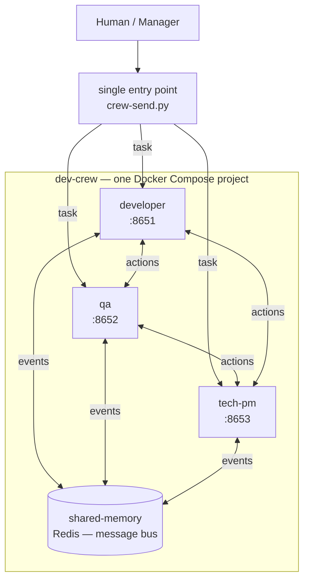

# Dev Crew — portable agent factory

A software development team made of isolated agents (Docker containers) that you can spin up anywhere with a single command. Every engineer runs in its own container, with its own tools and skills.

## The team

**Agents** — one container each, with its own tools and skills:

| Container | Role | Door (webhook) |
|-----------|------|----------------|
| `developer` | Writes code, opens PRs | `:8651` |
| `qa` | Tests and verifies quality | `:8652` |
| `tech-pm` | Breaks down work, prioritizes | `:8653` |

**Infrastructure** — shared services, one container each:

| Container | Purpose | Host ports |
|-----------|---------|------------|
| `shared-memory` | Redis message bus | `:6379` |
| `postgres-dev` | dev-cluster Postgres | `:5433` |
| `postgres-staging` | staging-cluster Postgres | `:5434` |
| `neo4j-dev` | dev-cluster Neo4j | `:7475` / `:7688` |
| `neo4j-staging` | staging-cluster Neo4j | `:7476` / `:7689` |

## How they communicate



- **One entry point** — a human or manager sends a task through `crew-send.py`, which signs it (HMAC-SHA256) and POSTs it to any agent's webhook door.
- **Agent ↔ agent** — any agent can address another through the same door (container DNS inside the `crew` network).
- **Shared bus** — `shared-memory` (Redis) is the common action registry for broadcast events between agents.

## Planning gate (discuss before code)

Agents do **not** start coding on receipt. Every task passes through a planning phase,
encoded in each agent's SOUL:

1. `tech-pm` writes a plan as a Linear ticket comment (approach, assumptions, risks, subtasks).
2. `developer` + `qa` review the plan in the comments, flag wrong assumptions.
3. **Manager approves explicitly** (comment "go"/"approved") — manual gate.
4. Only then does `developer` implement (feature branch → PR), and `qa` verify against the plan.

Linear ticket comments are the discussion channel (persistent + human-visible);
Redis stays the signal/notification layer.

## Universal clusters (project-agnostic)

The factory ships with two empty environments any project can use — no per-project setup:

| Cluster | Services | Host ports |
|---------|----------|------------|
| `dev-cluster` | `postgres-dev` + `neo4j-dev` | 5433 / 7475 / 7688 |
| `staging-cluster` | `postgres-staging` + `neo4j-staging` | 5434 / 7476 / 7689 |

Each project creates its own database/schema inside. Agents reach the clusters over
the `crew` network via env vars (`DEV_POSTGRES_URL`, `STAGING_NEO4J_URI`, …).
Credentials default in compose, overridable via `.env`.

## Project layout

```
docker-compose.yml          # the whole team: 3 agents + Redis + clusters
agents/<name>/hermes-home/  # isolated home per agent (config.yaml + SOUL.md)
crew/crew-send.py           # door client — send a message to any agent
crew/agents.json            # agent registry (urls + secrets, gitignored)
bus/action-schema.json      # message schema for the bus
tokens/tokens.example.yaml  # per-agent tokens template
workspace/                  # shared code area (mounted into agents; gitignored)
```

## Quick start

```bash
# 1. Start the factory (3 agents + Redis bus + dev/staging clusters)
docker compose up -d

# 2. Ping an agent via CLI
docker exec dev-crew-developer hermes chat -q "hello"

# 3. Send a message through a webhook door (from the host)
python3 crew/crew-send.py developer "do this task"

# 4. Agent → agent (from inside a container)
docker exec dev-crew-developer python3 /opt/crew/crew-send.py qa "request" --container
```

Doors map to host ports: `developer` 8651, `qa` 8652, `tech-pm` 8653.
Agent registry: `crew/agents.json` (real, gitignored) + `crew/agents.example.json` (template).

## Dashboard (observability)

```bash
python3 dashboard/app.py     # then open http://localhost:8660
```

Live team view: which agents are up, their state (`working` / `idle` / `down`) and the current task. A reporter loop polls each agent's `/health` + gateway log and writes status/activity to Redis (`shared-memory`). The dashboard renders it as a live page (auto-refresh every 2s).

## Status

Foundation: agents + Redis + universal clusters + planning gate are wired up
(see `docs/architecture.md` and the Linear epic). Next: exercise the planning
gate end-to-end on a real project.
