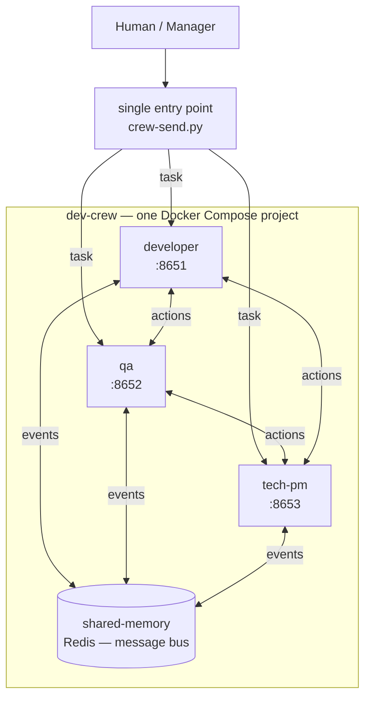

# Dev Crew — portable agent factory

A software development team made of isolated agents (Docker containers) that you can spin up anywhere with a single command. Every engineer runs in its own container, with its own tools and skills.

## The team

| Container | Role | Door (webhook) |
|-----------|------|----------------|
| `developer` | Writes code, opens PRs | `:8651` |
| `qa` | Tests and verifies quality | `:8652` |
| `tech-pm` | Breaks down work, prioritizes | `:8653` |
| `shared-memory` | Shared Redis message bus | — |

## How they communicate



- **One entry point** — a human or manager sends a task through `crew-send.py`, which signs it (HMAC-SHA256) and POSTs it to any agent's webhook door.
- **Agent ↔ agent** — any agent can address another through the same door (container DNS inside the `crew` network).
- **Shared bus** — `shared-memory` (Redis) is the common action registry for broadcast events between agents.

## Project layout

```
docker-compose.yml          # the whole team: 3 agents + Redis
agents/<name>/hermes-home/  # isolated home per agent (config.yaml + SOUL.md)
crew/crew-send.py           # door client — send a message to any agent
crew/agents.json            # agent registry (urls + secrets, gitignored)
bus/action-schema.json      # message schema for the bus
tokens/tokens.example.yaml  # per-agent tokens template
```

## Quick start

```bash
# 1. Start the factory (3 agents + shared-memory Redis)
docker compose up -d

# 2. Ping an agent via CLI
docker exec dev-crew-developer hermes chat -q "hello"

# 3. Send a message through a webhook door (from the host)
python3 crew/crew-send.py developer "do this task"

# 4. Agent → agent (from inside a container)
docker exec dev-crew-developer python3 /opt/crew/crew-send.py qa "request" --container
```

Doors map to host ports: `developer` 8651, `qa` 8652, `tech-pm` 8653.
Agent registry: `crew/agents.json` (real, gitignored) + `crew/agents.example.json` (template).

## Status

Active work in progress. See `docs/architecture.md` and the Linear epic.
