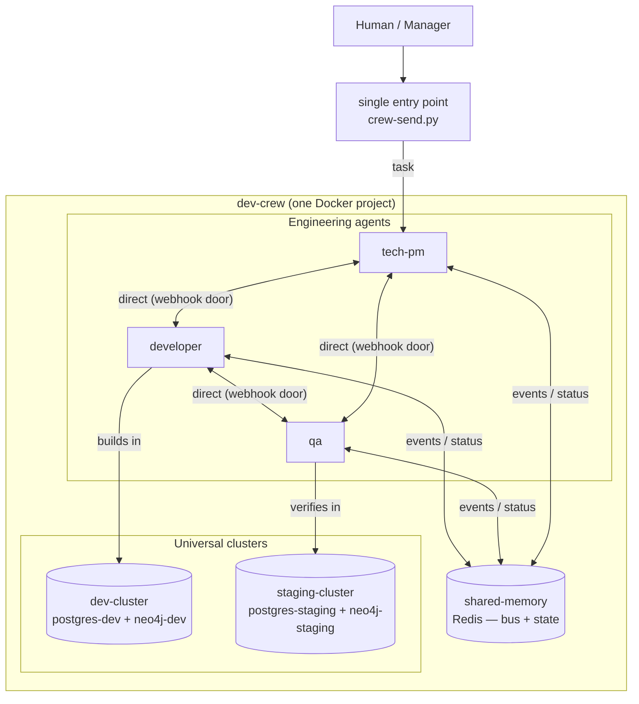

# Dev Crew — architecture

> Draft. Refined as requirements evolve.

## Overview

A team of isolated agents (one Docker container each) plus shared infrastructure,
orchestrated as a single Docker Compose project.



## Components

- **Agents** — isolated containers, each with its own Hermes runtime, tools and SOUL.
- **shared-memory** — Redis: message bus (pub/sub + inbox queues) and shared state.
- **entry point** — `crew-send.py` signs a message and POSTs it to any agent's webhook door.
- **workspace** — a shared bind-mounted directory (`./workspace:/workspace`) where code lives.
  Developer and qa have read/write, tech-pm read-only.
- **Universal clusters** — project-agnostic dev/staging environments (see below).

## Contracts

1. **LLM API** — OpenAI-compatible (`OPENAI_BASE_URL` + `OPENAI_API_KEY` + model).
2. **Message envelope** — `bus/action-schema.json` (`actor` / `action` / `target` / `payload` / `timestamp`).
3. **Tokens** — `tokens/tokens.yaml` (real values, gitignored), mounted read-only per agent.
4. **Door** — each agent exposes `POST /webhooks/inbox`, HMAC-SHA256 signed (`X-Hub-Signature-256`).

## Communication

- **Human/manager → agent** — `crew-send.py <agent> "<message>"` (host) or from any container.
- **Agent → agent** — same door, using container DNS: `crew-send.py <agent> "<message>" --container`.
- **Agent → bus** — publish events/status to Redis (the action registry).
- **Discussion channel** — Linear ticket comments are the source of truth for task decisions
  (persistent, human-visible, searchable). Redis is the signal/notification layer, not the record.

## Planning gate (discuss before code)

Every task passes through a planning phase before execution. The rule is encoded in
each agent's SOUL (`Planning gate` section):

```
task (Linear ticket)
   → tech-pm writes a PLAN as a ticket comment (approach, assumptions, risks, subtasks)
   → developer + qa review the plan in the comments (flag wrong assumptions)
   → manager explicitly approves (comment "go"/"approved")  ← manual gate
   → developer implements (feature branch → PR)
   → qa verifies against the approved plan in staging-cluster
   → completion: comment + state change in Linear, ping manager
```

No code is written until the plan is approved. This prevents agents from working
hard on wrong assumptions.

## Universal clusters (project-agnostic)

Two isolated environments, shared by every project. Clusters start **empty** — each
project creates its own database/schema inside them (no per-project containers).

| Cluster | Services | Host ports | Purpose |
|---------|----------|------------|---------|
| dev-cluster | `postgres-dev`, `neo4j-dev` | 5433 / 7475+7688 | developer builds and breaks freely |
| staging-cluster | `postgres-staging`, `neo4j-staging` | 5434 / 7476+7689 | qa verifies release candidates |

Agents reach them over the `crew` network via environment variables:
`DEV_POSTGRES_URL`, `STAGING_POSTGRES_URL`, `DEV_NEO4J_URI` + `DEV_NEO4J_AUTH`,
`STAGING_NEO4J_URI` + `STAGING_NEO4J_AUTH`. Credentials default in compose and are
overridable via `.env` (see `.env.example`).

## Open questions

- What exactly agents write to shared memory (granularity of the bus).
- Whether the planning gate stays manual or becomes auto-approve after agreement.
- Whether projects need additional cluster services (message queue, object storage).
