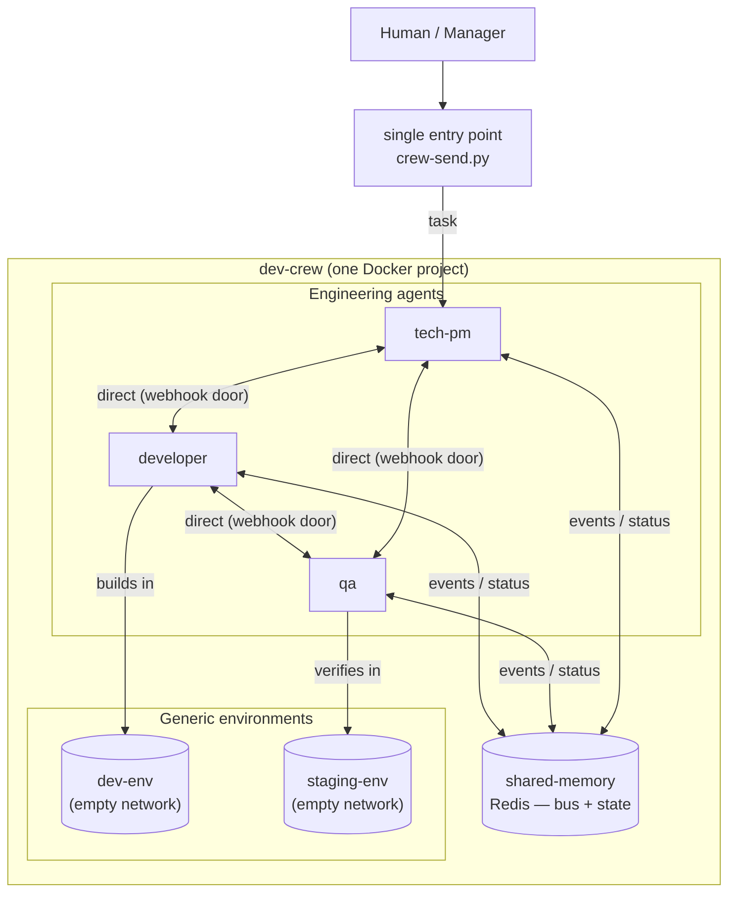

# Dev Crew — architecture

> Draft. Refined as requirements evolve.

## Overview

A team of isolated agents (one Docker container each) plus shared infrastructure,
orchestrated as a single Docker Compose project.



## Components

- **Agents** — isolated containers, each with its own Hermes runtime, tools and SOUL.
- **shared-memory** — Redis: message bus (pub/sub + inbox queues) and shared state.
- **entry point** — `crew-send.py` signs a message and POSTs it to any agent's webhook door.
- **workspace** — a shared bind-mounted directory (`./workspace:/workspace`) where code lives.
  Developer and qa have read/write, tech-pm read-only.
- **Generic environments** — project-agnostic dev/staging networks (see below).

## Contracts

1. **LLM API** — OpenAI-compatible (`OPENAI_BASE_URL` + `OPENAI_API_KEY` + model).
2. **Message envelope** — `bus/action-schema.json` (`actor` / `action` / `target` / `payload` / `timestamp`).
3. **Tokens** — `tokens/tokens.yaml` (real values, gitignored), mounted read-only per agent.
4. **Door** — each agent exposes `POST /webhooks/inbox`, HMAC-SHA256 signed (`X-Hub-Signature-256`).

## Communication

- **Human/manager → agent** — `crew-send.py <agent> "<message>"` (host) or from any container.
- **Agent → agent** — same door, using container DNS: `crew-send.py <agent> "<message>" --container`.
- **Agent → bus** — publish events/status to Redis (the action registry).
- **Discussion channel** — Linear ticket comments are the source of truth for task decisions
  (persistent, human-visible, searchable). Redis is the signal/notification layer, not the record.

## Planning gate (discuss before code)

Every task passes through a planning phase before execution. The rule is encoded in
each agent's SOUL (`Planning gate` section):

```
task (Linear ticket)
   → tech-pm writes a PLAN as a ticket comment (approach, assumptions, risks, subtasks)
   → developer + qa review the plan in the comments (flag wrong assumptions)
   → manager explicitly approves (comment "go"/"approved")  ← manual gate
   → developer implements (feature branch → PR)
   → qa verifies against the approved plan in staging-env
   → completion: comment + state change in Linear, ping manager
```

No code is written until the plan is approved. This prevents agents from working
hard on wrong assumptions.

## Generic environments (project-agnostic)

Two isolated, empty networks shared by every project. The foundation provides the
networks; each project brings its own services via its own compose file.

| Environment | Network (name) | Owner | Purpose |
|-------------|----------------|-------|---------|
| dev-env | `dev-crew-dev-env` | developer | sandbox — build/test/break freely (pre-PR) |
| staging-env | `dev-crew-staging-env` | devops | pre-prod gate — merged code, QA-verified |

A project declares its services in `workspace/<project>/compose.yml` and attaches to
`dev-env` / `staging-env` via `external: true`. Services are named `<service>-dev` /
`<service>-staging`. Agents reach them by service name over the relevant network.
Connection strings and credentials live in the project, not the foundation.

## Foundation vs instance vs project (separation of concerns)

The factory is a **template**: one versioned repo that can be cloned into any number of
running instances. Three layers exist and must never mix.

### 1. Foundation — the template (versioned, shared)

Who the agents ARE and what they CAN do. Lives in this repo, tracked by git, updated
by `git pull`. Identical across every instance.

| Concern | Location |
|---|---|
| Identity (role) | `agents/<name>/hermes-home/SOUL.md` |
| Capabilities | `agents/<name>/skills/` |
| Team + infra definition | `docker-compose.yml` |
| Communication protocol | `crew/`, `bus/` |
| Docs | `docs/`, `README.md` |

### 2. Instance config — per-machine (gitignored)

Secrets and addresses that differ per running instance. Never committed.

| Concern | Location |
|---|---|
| Cluster passwords | `.env` (template: `.env.example`) |
| Agent tokens | `tokens/tokens.yaml` |
| Door registry (HMAC secrets + URLs) | `crew/agents.json` |

### 3. Project work — what agents produce (outside the foundation)

The code, data and backlog of the products the factory builds. Never enters this repo.

| Concern | Location |
|---|---|
| Project code | `workspace/<project>/` (its own git repo) |
| Project data | cluster volumes (its own schema/DB inside the shared clusters) |
| Project backlog | a **separate Linear project** |

### Update flow (foundation upgrades don't touch project work)

```
foundation change → PR → merge on GitHub → git pull on an instance
   → agents reload SOUL/skills ("become smarter")
project work is untouched: workspace/, cluster data, and Linear projects are separate
```

### Agent self-awareness

An agent's context is assembled from the layers, nothing project-specific is baked in:

- **WHO I am** → `SOUL.md` (foundation)
- **WHAT I can do** → skills (foundation)
- **WHERE the infra is** → env vars: cluster URLs, workspace path (instance config)
- **WHAT to do now** → the Linear ticket (project, arrives with each dispatch)

Project context arrives per-task; the foundation stays project-agnostic.

## Open questions

- What exactly agents write to shared memory (granularity of the bus).
- Whether the planning gate stays manual or becomes auto-approve after agreement.
- Whether projects need additional cluster services (message queue, object storage).
