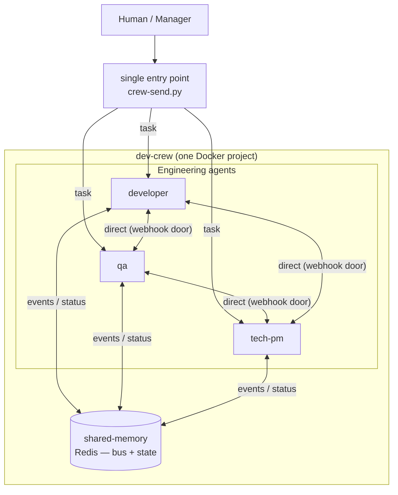

# Dev Crew — architecture

> Draft. Refined as requirements evolve.

## Overview

A team of isolated agents (one Docker container each) plus shared infrastructure,
orchestrated as a single Docker Compose project.

## Components

- **Agents** — isolated containers, each with its own Hermes runtime, tools and SOUL.
- **shared-memory** — Redis: message bus (pub/sub + inbox queues) and shared state.
- **entry point** — `crew-send.py` signs a message and POSTs it to any agent's webhook door.

## Contracts

1. **LLM API** — OpenAI-compatible (`OPENAI_BASE_URL` + `OPENAI_API_KEY` + model).
2. **Message envelope** — `bus/action-schema.json` (`actor` / `action` / `target` / `payload` / `timestamp`).
3. **Tokens** — `tokens/tokens.yaml` (real values, gitignored), mounted read-only per agent.
4. **Door** — each agent exposes `POST /webhooks/inbox`, HMAC-SHA256 signed (`X-Hub-Signature-256`).

## Communication

- **Human/manager → agent** — `crew-send.py <agent> "<message>"` (host) or from any container.
- **Agent → agent** — same door, using container DNS: `crew-send.py <agent> "<message>" --container`.
- **Agent → bus** — publish events/status to Redis (the action registry); future milestone.

## Clusters (future)

`dev-cluster`, `staging-cluster`, `preprod-cluster` — isolated environments where agents
deploy their output. Not wired up yet.

## Open questions

- What exactly agents write to shared memory (granularity of the bus).
- Who dispatches tasks — an external manager or the Tech PM itself.
- How agents reach the clusters (shared docker network vs separate hosts).
